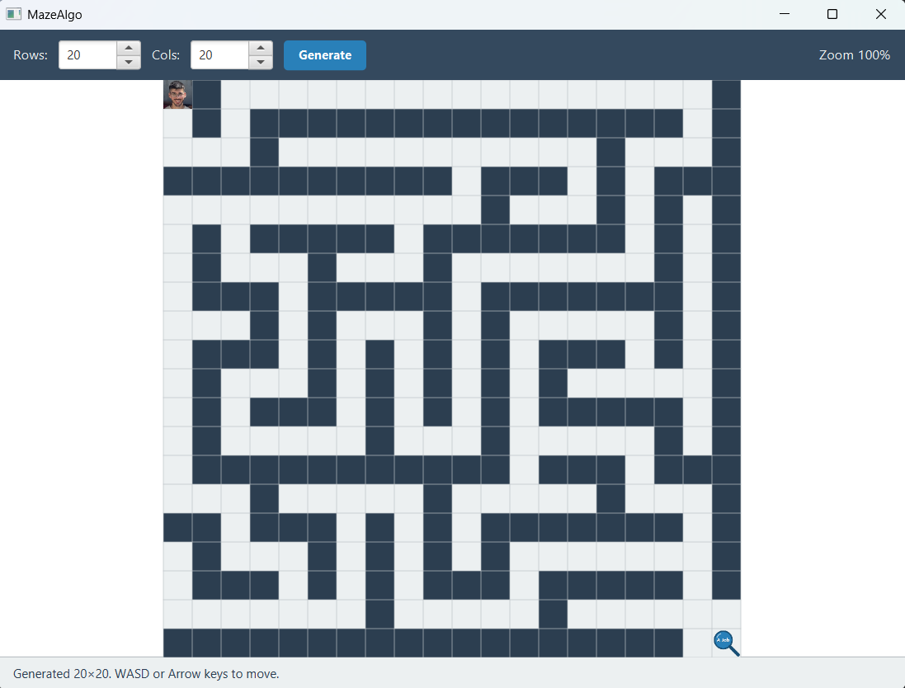
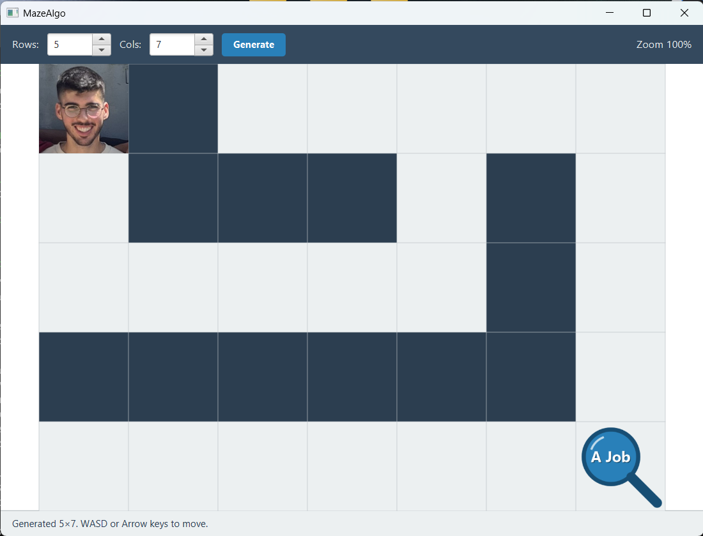

# MazeAlgo

[](https://github.com/daney23/MazeAlgo-Project/actions/workflows/build.yml)
[](https://daney23.github.io/MazeAlgo-Project/)

**A 2D / 3D maze generation and search engine with a multi-threaded server backend and a JavaFX GUI.**

This started as a university assignment and is being built out into a portfolio-grade project: clean MVVM separation, classic GoF design patterns, multi-threaded networking with smart caching, and full unit + integration test coverage.

| | |
|:---:|:---:|
|  |  |
| Generated 20×20 maze with player and "A Job" goal | Close-up showing the sprites + grid |

---

## TL;DR

- **What it is.** A maze engine — generates 2D/3D mazes, solves them with BFS / DFS / Best-First (A* with admissible heuristics), and serves both operations over sockets.
- **Status.** All four phases done. `mvn clean test` → BUILD SUCCESS, 42 / 42 tests pass. The JavaFX UI launches via `mvn javafx:run` — generate a maze, drive the player with WASD or arrow keys, zoom with `Ctrl + scroll`, click-drag to pan (right-click recenters), click **Solution Hint** to draw the optimal path, click **Watch Search** to see Best-First explore cells in real time, and a sound effect plays when you reach the goal. `mvn javadoc:javadoc` generates the full API docs.
- **For the technically curious.** Adapter, Strategy, Decorator, and Template Method patterns all appear here in real load-bearing roles — not as toy examples. The server caches solutions on disk keyed by SHA-256 of the maze bytes; an integration test confirms the search algorithm runs exactly once across two identical requests.

---

## Tech stack

| Layer | Choice |
|---|---|
| Language | Java 17 (compiled with `--release 17`, runs on JDK 17+) |
| Build | Maven 3.9 |
| UI | JavaFX 17.0.11 — controls, fxml, media |
| Logging | Log4j2 |
| Tests | JUnit Jupiter 5.8.1 (42 tests, all passing) |

---

## What's interesting in here

- **Three search algorithms over a common interface.** BFS, DFS, and a Best-First Search that behaves like A* when the domain supplies an admissible heuristic. Octile distance for 2D (diagonal moves cost more than straight moves), Manhattan distance scaled by step-cost for 3D — both proven admissible in comments next to the code.
- **Adapter pattern** keeps the search algorithms decoupled from the maze representation: `SearchableMaze` and `SearchableMaze3D` expose `Maze` / `Maze3D` as a generic `ISearchable`, so the same `BestFirstSearch` solves both 2D and 3D problems with zero changes.
- **Iterative DFS** (explicit stack, no recursion) so a 1000×1000 maze doesn't blow the JVM stack.
- **Diagonal move legality.** A diagonal step in 2D is only allowed when at least one of the two orthogonal cells around the corner is also open — paths can't squeeze through a wall pinhole.
- **Multi-threaded socket server** with an `ExecutorService` thread pool and a `setSoTimeout`-driven accept loop, so `stop()` is responsive even when no clients are connecting.
- **Smart caching.** Identical solve requests don't re-run the algorithm — `SolutionCache` keys solutions by SHA-256 of the maze bytes and stores them on disk under `$TMPDIR/MazeAlgo/cache/`. An integration test verifies that two identical requests invoke the search algorithm exactly once.
- **Streaming run-length encoding** via the `MyCompressorOutputStream` Decorator — a 10,000-byte sparse maze grid lands in well under 1 KB on the wire (>10× compression, asserted in the test suite).
- **MVVM data binding all the way down.** The custom `MazeDisplayer` `Canvas` binds to `MazeViewModel` properties (`maze`, `playerRow`, `playerColumn`, `zoom`) — moving the player updates the model, the view re-paints automatically, no manual `repaint()` plumbing.
- **Synthesized victory chime.** No third-party audio assets needed — a C–E–G–C arpeggio is generated in code with `javax.sound.sampled` (with linear fade envelopes to avoid clicks). Drop a real `.mp3` / `.wav` into `src/main/resources/mazealgo/view/sounds/` to override.
- **42 tests, all passing**, including a full end-to-end test that spins up `MyServer` on an OS-assigned port and verifies both strategies via real sockets, 10 ViewModel tests covering movement rules and the diagonal-pinhole edge case, and 6 listener-contract tests that pin the per-node observer hook used by the UI's "Watch Search" visualizer.

---

## Architecture

```
                           ┌──────────────────────────────────┐
                           │   View  (JavaFX)                 │
                           │   MazeView.fxml + Controller     │
                           │   MazeDisplayer Canvas           │
                           └────────────────┬─────────────────┘
                                            │ binds to JavaFX properties
                           ┌────────────────▼─────────────────┐
                           │           ViewModel              │
                           │   maze / solution / playerRow    │
                           │   playerColumn   (Observable)    │
                           └────────────────┬─────────────────┘
                                            │
                           ┌────────────────▼─────────────────┐
                           │            Model                 │
                           │   ┌────────────┐  ┌───────────┐  │
                           │   │ Algorithms │  │  Server   │  │
                           │   │ (gen+sea-  │  │ + Cache + │  │
                           │   │  rch +     │  │  Compres- │  │
                           │   │  adapters) │  │  sion     │  │
                           │   └────────────┘  └───────────┘  │
                           └──────────────────────────────────┘
```

**The UI talks to the server, not the algorithms directly.** When you launch `mvn javafx:run`, `MazeApp.start()` spawns two embedded `MyServer` instances on OS-assigned ports (one hosting `GenerateMazeStrategy`, one hosting `SolveMazeStrategy`) and injects those ports into `MazeModel` via the FXMLLoader controller factory. Every **Generate** click sends `int[]{rows, cols}` over a socket, receives RLE-compressed bytes, and reconstructs the `Maze`. Every **Solution Hint** click sends the `Maze` over a socket and receives a `Solution` from the SHA-256-keyed cache (or a fresh Best-First run on cache miss). The **Watch Search** mode stays in-process — it needs the per-node observer callback that the server protocol doesn't stream.

---

## Design patterns at a glance

| Pattern | Where | Why it's here |
|---|---|---|
| **Adapter** | `SearchableMaze`, `SearchableMaze3D` | The search algorithms speak `ISearchable`, not `Maze`. The adapters expose a 2D `Maze` (8 neighbours, diagonals with the pinhole rule) and a 3D `Maze3D` (6 neighbours, no diagonals) under the same interface, so one `BestFirstSearch` solves both dimensionalities with zero changes. |
| **Strategy** | `ISearchingAlgorithm` (`BreadthFirstSearch`, `DepthFirstSearch`, `BestFirstSearch`) | Swappable searchers behind a uniform `solve(ISearchable) → Solution` contract. Adding a new algorithm doesn't touch any caller — the `MazeViewModel`, the `SolveMazeStrategy`, the `SolutionCache` all keep working. |
| **Strategy** | `IServerStrategy` (`GenerateMazeStrategy`, `SolveMazeStrategy`) | One pluggable behaviour per server endpoint. `MyServer` doesn't know what the strategy does; it just dispatches sockets to it. Adding a new endpoint = one new class implementing `serverStrategy(in, out)`. |
| **Decorator** | `MyCompressorOutputStream` / `MyDecompressorInputStream` | Wrap any `OutputStream` / `InputStream` to add streaming run-length encoding without anyone caring. The server hands a wrapped stream to the generate path; the client unwraps with the matching decorator. Same maze bytes go in either side of the wrapper. |
| **Template Method** | `ASearchingAlgorithm`, `AMazeGenerator`, `AMaze3DGenerator` | Shared concerns (counter reset, the per-node listener callback, timing) live in the base class; subclasses fill in only the variable bits (open structure for searchers, carve algorithm for generators). |
| **Factory (Supplier)** | `SolveMazeStrategy(cache, () -> new BestFirstSearch())` | A fresh searcher per request, injected as a `Supplier` — keeps the strategy testable (the integration test verifies the cache by counting how often the supplier is invoked) and avoids leaking state across pooled solves. |
| **Observer (callback)** | `ASearchingAlgorithm.setNodeEvaluatedListener(...)` | Lets the UI watch the search happen. The "Watch Search" button registers a listener that funnels each evaluated state into the canvas's visited-cells set on the JavaFX thread. Server / sync paths register no listener and pay nothing. |

---

## Algorithms

### Best-First Search (A\*-like)

`src/main/java/mazealgo/model/algorithms/search/BestFirstSearch.java`

Reuses the BFS skeleton but swaps the FIFO queue for a `PriorityQueue` ordered by `cost-so-far + domain.heuristic(state, goal)`. Because the heuristics in `SearchableMaze` and `SearchableMaze3D` are admissible, the returned path is optimal.

```java
openList = new PriorityQueue<>(
    Comparator.comparingDouble(s -> s.getCost() + domain.heuristic(s, goal))
);
return super.solve(domain);
```

### Octile distance heuristic (2D, with diagonals)

`src/main/java/mazealgo/model/algorithms/search/SearchableMaze.java`

```java
// 10 * max(|dr|,|dc|) + 5 * min(|dr|,|dc|)
// — the exact optimal cost on an unobstructed grid, hence admissible.
return 10 * Math.max(dr, dc) + 5 * Math.min(dr, dc);
```

### Iterative randomized DFS maze generator

`src/main/java/mazealgo/model/algorithms/mazeGenerators/MyMazeGenerator.java`

The classic "recursive backtracker" rewritten with an explicit `Deque` stack so it scales to mazes larger than the JVM thread stack would allow.

---

## Server protocol

Two ports, one strategy each. The client speaks `Object` streams; the server-to-client direction is RLE-compressed for the generate endpoint. Ports 5400 / 5401 are the standalone-demo defaults — when the JavaFX app boots, it spawns both servers on OS-assigned ports instead.

```
GENERATE (default port 5400)
   client →  ObjectOutputStream  →  int[]{rows, columns}      →  server
   client  ←──── byte[] (RLE-compressed Maze.toByteArray) ────  server

SOLVE (default port 5401)
   client →  ObjectOutputStream  →  Maze                       →  server
   client  ←─────────── Solution ──────────────                 server
       (server consults SolutionCache before running search)
```

`SolutionCache` keys on `SHA-256(Maze.toByteArray())`. A corrupted cache entry is dropped silently — the next request rebuilds it.

---

## Build & run

You'll need JDK 17+ and Maven 3.6+.

```bash
# Run all tests (42, all passing)
mvn clean test

# Compile only
mvn compile

# Launch the JavaFX UI
mvn javafx:run

# Generate the full API docs at target/site/apidocs/
mvn javadoc:javadoc
```

### Demo: start the server, hit it from a client

In two terminals:

```bash
# Terminal 1
mvn -q exec:java -Dexec.mainClass=mazealgo.examples.RunMazeServer

# Terminal 2
mvn -q exec:java -Dexec.mainClass=mazealgo.examples.RunMazeClient
```

(The integration test does the same thing in-process, so the demo isn't load-bearing — it's just for visual confirmation.)

---

## Project structure

```
src/main/java/mazealgo/
├── MazeApp.java                            JavaFX Application entry — spawns embedded servers
├── Launcher.java                           workaround for non-modular JavaFX launch
├── model/
│   ├── MazeModel.java                      facade — talks to the embedded servers over sockets
│   ├── algorithms/
│   │   ├── mazeGenerators/                 Maze, Position, generators (Empty/Simple/My)
│   │   ├── maze3D/                         Maze3D, Position3D, generators, SearchableMaze3D
│   │   └── search/                         ISearchable, AState, BFS, DFS, BestFirstSearch, SearchableMaze, Solution
│   ├── io/                                 MyCompressorOutputStream, MyDecompressorInputStream
│   └── server/                             MyServer, IServerStrategy, Generate/SolveMazeStrategy, SolutionCache
├── view/                                   MazeDisplayer / Maze3DDisplayer canvases, controller, SoundPlayer
├── viewmodel/                              MazeViewModel + MovementDirection — JavaFX-property bridge
└── examples/                               manual runners + RunMazeServer/RunMazeClient

src/test/java/...                            42 tests across compression, byte serialization,
                                             cache, search correctness, ViewModel movement rules,
                                             the listener contract, and end-to-end server
```

---

## Roadmap

- [x] **Phase 1** — Maven migration, MVVM scaffolding, Serializable refactor for the upcoming wire protocol, base + reset hook on `ASearchingAlgorithm` (fixes a real bug: early goal-find used to leave stale states in the BFS open list and corrupt the next reuse).
- [x] **Phase 2** — Multi-threaded server, Decorator-pattern compression, content-addressed solution cache.
- [x] **Phase 3** — JavaFX GUI: custom `MazeDisplayer` canvas (sprite-capable, falls back to drawn shapes so it works without assets), WASD / arrow-key movement, `Ctrl + scroll` zoom, victory sound via JavaFX `AudioClip` (with a `javax.sound.sampled` synthesized fallback when no audio file is bundled). The diagonal pinhole rule still governs `SearchableMaze` and therefore the search algorithm's edges. Background music slot in place — drop an mp3 in `src/main/resources/mazealgo/view/sounds/` to activate.
- [x] **Phase 4** — Algorithm visualizer: a **Solution Hint** button draws the optimal path on the canvas as an orange dotted line; a **Watch Search** button animates Best-First over a 3-second budget, painting each cell yellow as it enters the visited set; a live nodes-evaluated counter in the toolbar updates as the search proceeds. The `numberOfNodesEvaluated` observer hook on `ASearchingAlgorithm` is also useful outside the UI (server logs use it, the integration test asserts on it). `maven-javadoc-plugin` wired — `mvn javadoc:javadoc` generates the full API docs.

---

## Author

[**daney23 — Eyal Dan**](https://github.com/daney23) — Software & Information Systems Engineering Student @ BGU. Built on Windows with IntelliJ IDEA and JDK 17 / 25.
